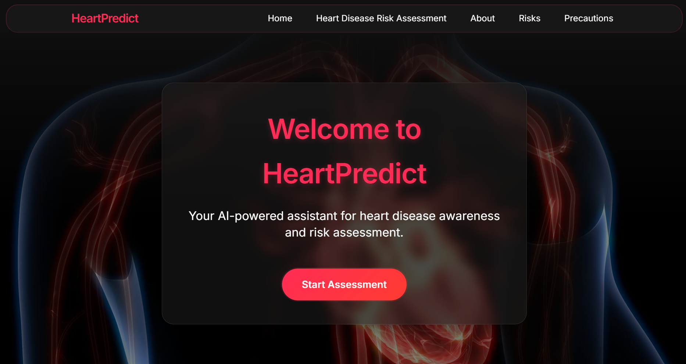
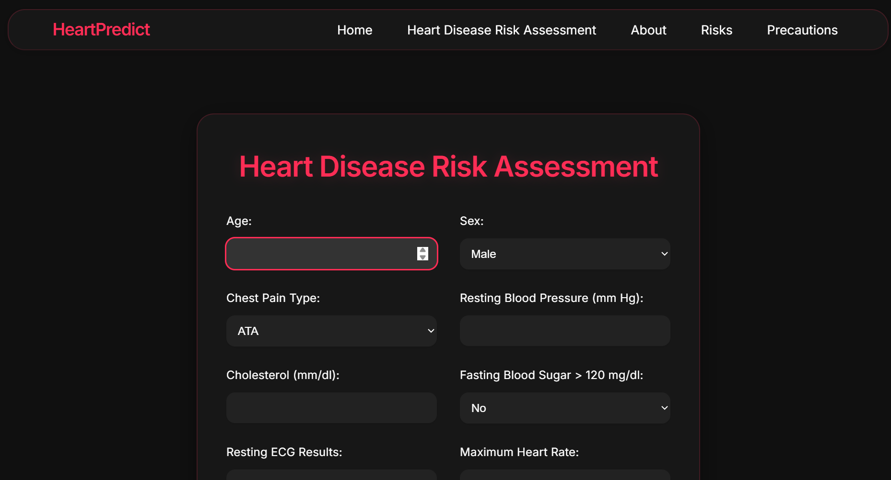
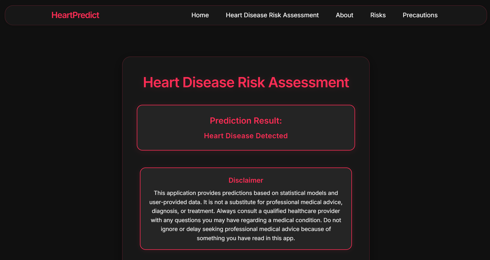

# HeartPredict: Heart Disease Risk Assessment Web App

---

## 🚀 Overview
**HeartPredict** is a modern web application that leverages machine learning to assess your risk of heart disease. Enter your health parameters and receive instant, AI-powered predictions, along with educational resources about heart disease, risk factors, and prevention tips.

---

## 🖥️ Live Demo

<div align="center">
  
  <br/><br/>
  
  <br/><br/>
  
</div>

---

## ✨ Features
- **Heart disease risk prediction** using a trained ML model
- **User-friendly web interface**
- **Informative sections:** About, Risks, Precautions
- **Responsive design** with a modern UI
- **Disclaimer and educational content**

---

## 🛠️ Getting Started

### Prerequisites
- Python 3.8+
- pip

### Installation
1. **Clone the repository:**
   ```bash
   git clone <your-repo-url>
   cd heart_disease_app
   ```
2. **Create and activate a virtual environment (optional but recommended):**
   ```bash
   python -m venv venv
   # On Windows:
   venv\Scripts\activate
   # On macOS/Linux:
   source venv/bin/activate
   ```
3. **Install dependencies:**
   ```bash
   pip install -r requirements.txt
   ```
   If `requirements.txt` is missing, install manually:
   ```bash
   pip install flask pandas scikit-learn numpy joblib
   ```

4. **Ensure the following files are present:**
   - `heart_disease_model.pkl` (trained model)
   - `label_encoders.pkl` (label encoders for categorical features)
   - `heart.csv` (dataset, optional for retraining)

### Running the App
```bash
python app.py
```
The app will be available at [http://127.0.0.1:5000](http://127.0.0.1:5000)

---

## 📁 Project Structure
```
heart_disease_app/
├── app.py
├── model_train.py
├── heart_disease_model.pkl
├── label_encoders.pkl
├── heart.csv
├── static/
│   ├── style.css
│   └── assets/
│       ├── assessment.png
│       ├── home.png
│       └── prediction.png
├── templates/
│   ├── base.html
│   ├── index.html
│   ├── about.html
│   ├── assess.html
│   ├── risks.html
│   └── precautions.html
└── venv/ (optional)
```

---

## 📝 Usage
- Go to the home page and click **"Start Assessment"**.
- Fill in the required health parameters.
- View your heart disease risk prediction and read the provided information.

---


## ⚠️ License
This project is for educational purposes. Please check dataset and model licenses if using for production. 